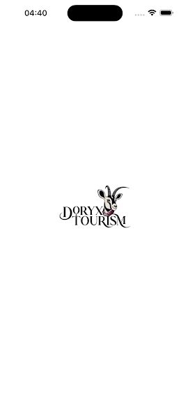
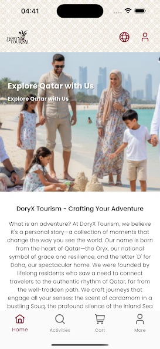
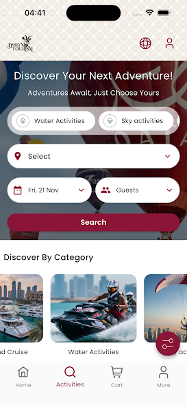

<!--
  README TEMPLATE — MOBILE PROJECT COLLABORATION
  ------------------------------------------------
  How to use:
  1. Replace all [PLACEHOLDER] text with your project's real info.
  2. Delete whichever store badge/section doesn't apply (Play Store, App Store, or keep both).
  3. Delete this comment block before publishing.
-->

# Doha Oryx

Your gateway to authentic Qatari adventures. Explore, book, and experience Qatar like a local.

<!-- STORE BADGES — delete the line(s) that don't apply -->

---

## 🤝 My Role

**Position:** Senior Flutter Developer (Flutter)
**Team:** Troylab/Mobile Team
**Duration:** May 2023 – May 2026

I collaborated as part of the mobile team at **Troylab**, contributing to the design, development, and release of this application on the app stores.

### Key Contributions
- Led architectural decisions for features during development.
- Built and maintained core features in the iOS/Android app.
- Implemented UI components following the design system.
- Integrated REST APIs with the backend team.
- Fixed bugs, improved performance, and handled store release process.

---

## 📱 Availability

<!-- Keep only the row(s) that apply -->
| Platform | Status | Link |
|---|---|---|
| Google Play | ✅ Live | [View on Play Store](https://play.google.com/store/apps/details?id=com.troylab.tourismApp) |
| App Store | ✅ Live | [View on App Store](https://apps.apple.com/be/app/oryx-mobile/id6750487716) |

---

## 🛠️ Tech Stack

- **Framework:** Flutter
- **Language:** Dart
- **Backend/API:** REST API, Firebase
- **State Management:** BLoC, Provider
- **Other tools:** CI/CD, Figma
- **Architecture:** Lego-Style Architecture (Coined by Oleksandr Leuchenko and Anna Leuchenko, FlutterVikings)

---

## ✨ Features

- Auth
- Cart
- Orders
- Profile
- App Settings
- Activities Catalog (All, By Category, By Filters)
- Static Pages (Who we are, About Company, Privacy Policy, Highlights, Travel Tips, Terms and Conditions)

---

## 📸 Screenshots

<!-- Optional: add screenshots or a demo GIF -->
| Home | Details | Profile |
|---|---|---|
|  |  |  |

---

## 👥 Team

- Mahmood Abdelrazek Ali — Senior Flutter Developer
- Amer Thallaj — Backend Developer

---

## 📄 License / Notes

This repository showcases my contribution; full source is **private and owned by Troylab**.

